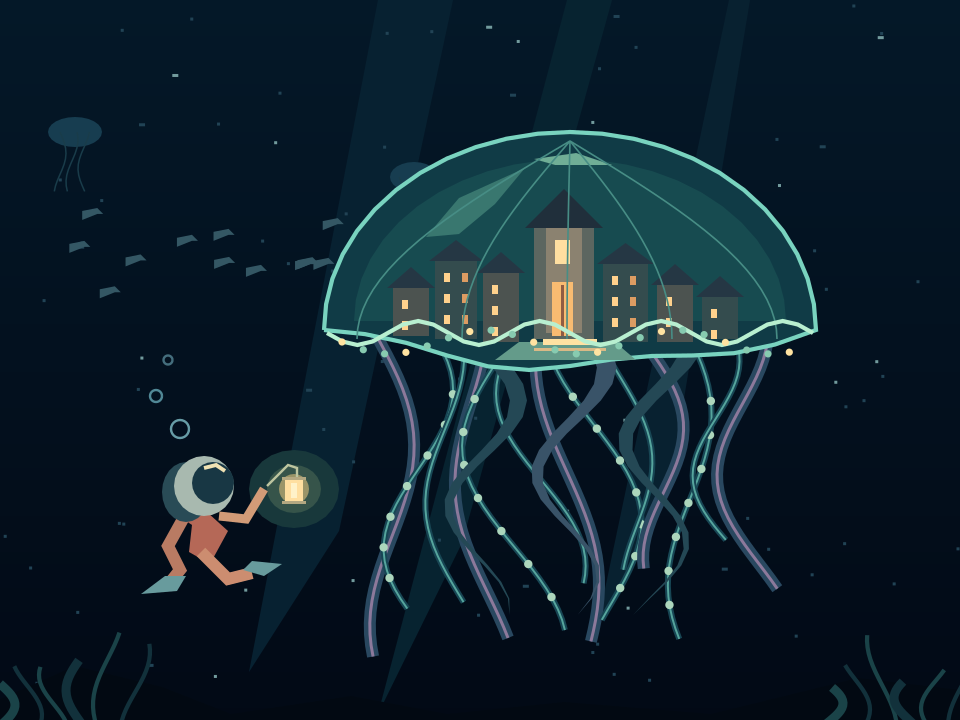

# Somebody's Still Awake

*Someone left the porch light on.*

A little city sheltered inside a luminous jellyfish, drifting through the deep.
A lone diver approaches with a lantern. Procedural JavaScript drawing: no loaded
bitmap, fonts, controller commands or application-side framebuffer handling.



`preview.png` is a **software-rendered reference**, not an LCD photograph.
Physical RGB565 colours and antialiasing can differ.

## Firmware and board

- Waveshare RP2350-Touch-LCD-2.8, using the ST7789T3 profile.
- Board target: `waveshare_rp2350_touch_lcd_2.8`.
- Requires `MCUJS_EXPERIMENTAL_CANVAS=ON`; ordinary builds leave Canvas disabled.
- Composed for a 320×240 landscape canvas. Other dimensions use one uniform
  scale and centred margins, never independent horizontal/vertical stretching.
- Uses only the portable Canvas subset through `display.canvas`.

## Run

Copy `somebodys-awake.js` to the MCUJS USB drive and **eject the drive** to return
filesystem ownership to the device. On a fresh runtime:

```js
var display = require('displays/st7789').connect();
require('/somebodys-awake.js')(display.canvas, function () {
  console.log('Demo complete!');
});
```

If a display is already open, reuse its canvas instead of opening another
connection to the same panel. The scene finishes after three one-shot callbacks
and leaves its final image displayed. No looping animation or autorun is added.

## Hardware verification

The exact source in this directory was run on firmware `0.1.0+6609a8c` and its
physical appearance was confirmed in a user photo. The drawing completed with
four presentations and zero reported presentation failures. Native allocated
memory was unchanged before and after the bounded drawing run.

The source SHA-256 is
`63e1b59ba5f3cbc4cac3c7ff70685c477c6dc4d1ceaf78f8f7728861f6158190`.

Touch, audio, SD and sensors are not used or claimed by this demo.
